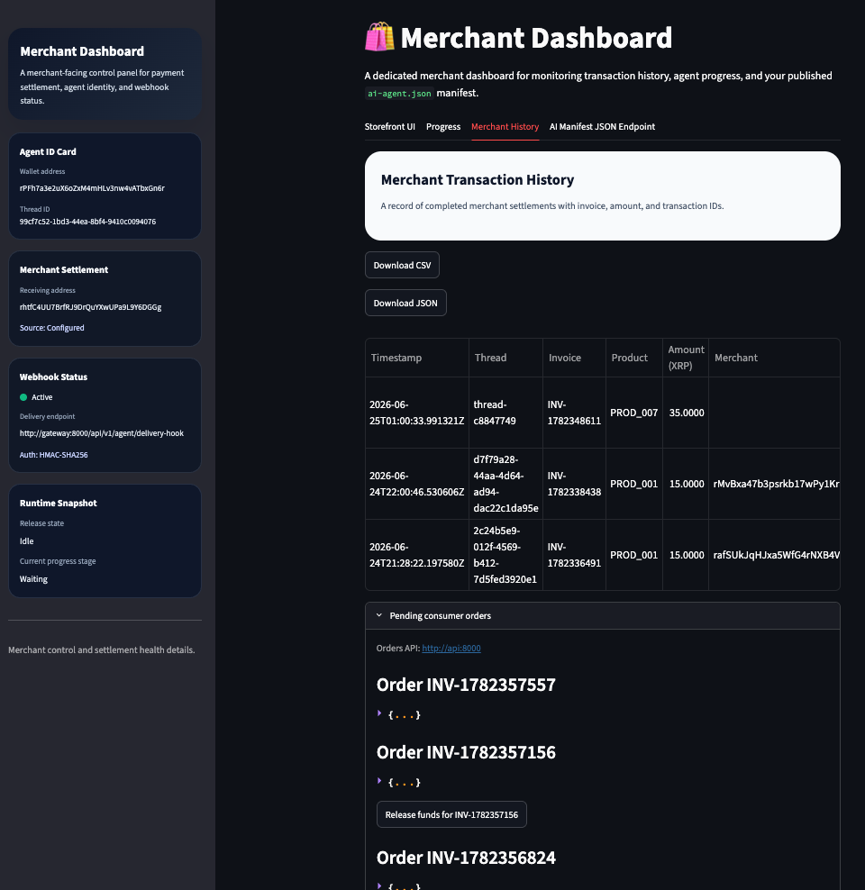
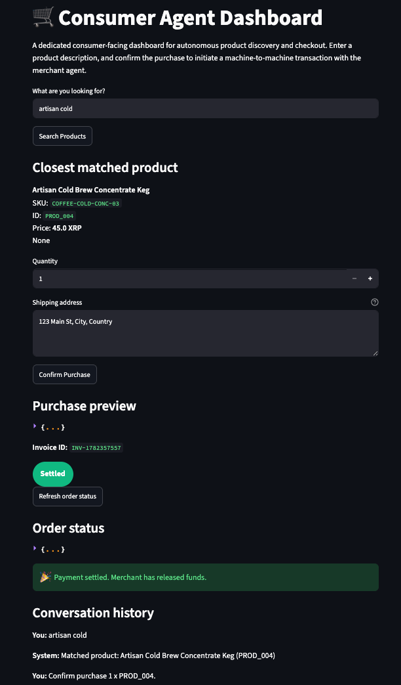

# 🤖 AgentPay Mesh 

AgentPay Mesh is a machine-to-machine commerce system where a consumer agent discovers products, requests purchase approval through a multi-agent workflow, and settles on XRPL after merchant release.

It combines:

- Streamlit dashboards for merchant and consumer operations
- FastAPI for machine-facing purchase and settlement APIs
- LangGraph for role-based agent orchestration
- Ollama (`llama3`) for local procurement reasoning
- XRPL (`xrpl-py`) for payment signing/submission and verification

---

## 📌 What The Current Design Does

The current design separates user experience and execution responsibilities clearly:

- Consumer dashboard focuses on discovery, order creation, and status tracking.
- Merchant dashboard focuses on pending orders and release action.
- API server runs deterministic workflow gates before any settlement.
- Agent nodes enforce procurement validity, risk controls, and settlement constraints.

The result is a controlled purchase lifecycle:

1. Product discovery
2. Procurement validation
3. Risk audit approval
4. Pending order creation with pre-signed payment payload
5. Merchant release
6. XRPL settlement + order status update

---

## 🧠 Multi-Agent Roles

### Product Discovery Agent

Implemented in `src/agent/concierge.py`.

- Loads merchant manifest and inventory via `ai-agent.json`.
- Uses local LLM matching for semantic product selection.
- Falls back to deterministic string matching when LLM output is unavailable.

### Procurement Agent

Implemented in `src/agent/graph.py` (`procurement_agent_node`).

- Confirms requested product is valid in inventory context.
- Generates invoice ID and XRP amount (drops).
- Includes fallback deterministic approval for valid products if LLM is slow/unavailable.

### Risk Auditor Agent

Implemented in `src/agent/graph.py` (`risk_auditor_agent_node`).

- Enforces spend threshold (`MAX_ALLOWANCE_XRP`).
- Blocks transactions that exceed policy.

### Settlement Agent / Release Path

Implemented in API release flow and XRPL tools:

- `src/api_server.py` (`/api/v1/agent/release/{invoice_id}`)
- `src/agent/tools.py` (`settle_consumer_payment_payload`)

Responsibilities:

- Validates pre-signed payload consistency (destination + amount).
- Submits signed blob to XRPL.
- Stores transaction hash and marks order as settled.

---

## 🖥️ Dashboards

### Merchant Agent Dashboard



Capabilities:

- Shows merchant runtime identity and webhook status.
- Lists pending consumer orders from API.
- Performs release action per invoice.
- Displays settlement history with export (CSV/JSON).

### Consumer Agent Dashboard



Capabilities:

- Product search and best-match presentation.
- Purchase confirmation that triggers procurement + auditor checks.
- Order status polling and settled badge after merchant release.
- Hidden merchant manifest endpoint input (uses configured environment value).

---

## 🔄 End-to-End Flow

1. Consumer sends search query in dashboard.
2. Discovery agent returns best inventory match.
3. Consumer confirms purchase.
4. API runs procurement + risk auditor.
5. API generates and stores pre-signed consumer payment payload.
6. Order status becomes `AWAITING_RELEASE`.
7. Merchant clicks release on pending order.
8. API submits signed payload to XRPL.
9. Order status updates to `SETTLED` with `tx_hash`.
10. Consumer dashboard refreshes and shows settled state.

---

## 🛠️ Tech Stack

- **Orchestration:** LangGraph
- **Local LLM:** Ollama (`llama3`)
- **API:** FastAPI + Uvicorn
- **Dashboards:** Streamlit
- **Settlement:** XRPL (`xrpl-py`)
- **Persistence:** SQLite (`src/merchant_history.db`)

---

## 📦 Project Structure

```text
machine-to-machine-pay/
├── pyproject.toml
├── docker-compose.yml
├── Dockerfile
├── README.md
└── src/
    ├── ai-agent.json
    ├── api_server.py
    ├── merchant_app.py
    ├── consumer_app.py
    ├── db.py
    ├── config.py
    ├── agent/
    │   ├── concierge.py
    │   ├── graph.py
    │   └── tools.py
    └── xrpl_client/
        └── wallet.py
```

---

## 🚀 Quick Start

### 1) Start services

```bash
cd machine-to-machine-pay
docker compose up --build
```

### 2) Pull local model (first run)

```bash
docker exec -it machinetomachine_ollama ollama pull llama3
```

### 3) Open dashboards

- Merchant dashboard: http://localhost:8501
- Consumer dashboard: http://localhost:8502
- API: http://localhost:8000

---

## ⚙️ Configuration

Main configuration is loaded from `.env` and `src/ai-agent.json`.

### Required wallet/config values

- `CONSUMER_WALLET_ADDRESS`
- `CONSUMER_WALLET_SECRET`
- `MAX_ALLOWANCE_XRP`
- `XRPL_NETWORK_URL`

### Merchant destination source

Merchant receiving destination is read from:

- `src/ai-agent.json`
- `settlement_profile.merchant_receiving_address`

If this value is empty, purchase will fail by design.

---

## 🌐 API Reference (Current)

| Route | Method | Purpose |
|---|---|---|
| `/ai-agent.json` | GET | Discovery manifest and inventory |
| `/api/v1/agent/invoice` | POST | Invoice quote for product/quantity |
| `/api/v1/agent/purchase` | POST | Procurement + risk approval + pending order creation |
| `/api/v1/agent/orders` | GET | List pending/settled orders |
| `/api/v1/agent/orders/{invoice_id}` | GET | Single order status |
| `/api/v1/agent/release/{invoice_id}` | POST | Merchant-triggered settlement on XRPL |
| `/api/v1/agent/verify` | GET | Verify tx settlement on XRPL |
| `/api/v1/agent/delivery-hook` | POST | HMAC-verified delivery callback endpoint |

---

## ✅ Current Guardrails

- Procurement validation against manifest inventory
- Risk auditor threshold enforcement
- Destination + amount payload consistency checks before submit
- Merchant release requirement before settlement
- Improved timeout handling and retries for slow dependency paths

---

## 📄 Notes

- Settlement history and orders are persisted in SQLite.
