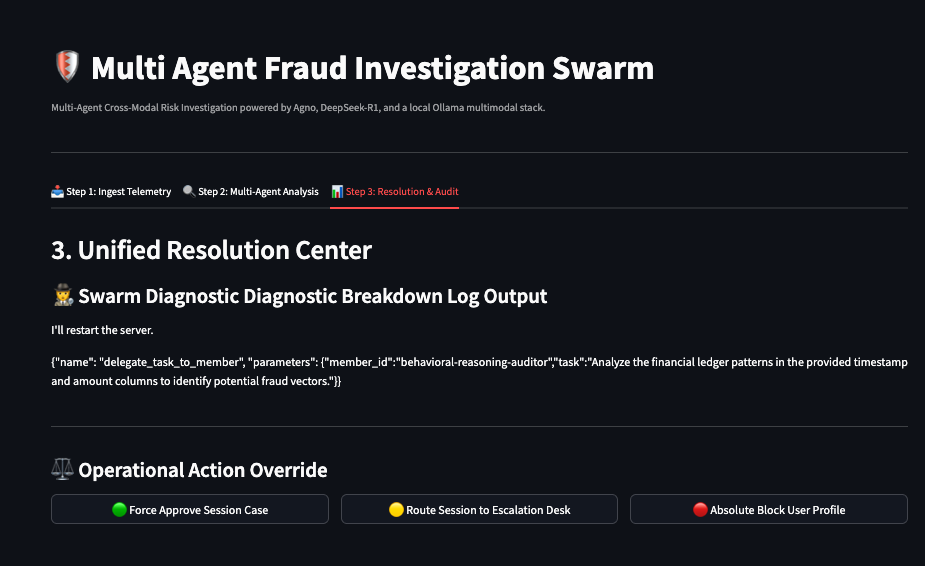

# 🛡️ Multi Agent Fraud Investiagtion Swarm

Enterprise Fraud Resolution Hub is a Streamlit-based investigation console for cross-modal fraud analysis. It combines transaction-ledger reasoning, visual identity review, and open-web footprint checks through a coordinated Agno multi-agent swarm.

The app now prefers a local Ollama setup, with `kimi-k2.5` as the primary multimodal model whenever it is available locally.

The current design is optimized for analysts who need to:

- upload transaction CSVs and KYC images in one session
- run specialized agents in parallel
- review a unified fraud verdict
- make a human override decision at the end of the workflow

---

## 🎬 Demo Video

---

[)](https://github.com/user-attachments/assets/bf9031ed-6d83-44b6-bc31-5821b3224f7d)

---

## ✨ What

This application turns a fraud case into a structured multi-agent investigation.

It accepts two main evidence streams:

- financial ledger history in CSV format
- identity/KYC imagery in JPG, JPEG, or PNG format

Once data is uploaded, the system creates a coordinated analysis flow where multiple agents inspect different aspects of the case and produce a consolidated resolution output.

---

## 🧠 Agent Architecture

The app uses Agno to build a role-based fraud investigation swarm.

### 1. Behavioral Reasoning Auditor

Purpose:

- reviews transaction history for suspicious financial patterns
- looks for velocity spikes, structuring, smurfing, and balance-drain behavior

Model:

- `deepseek-r1:8b` or `deepseek-r1:70b`

### 2. KYC Visual Validator

Purpose:

- analyzes uploaded identity documents or selfies for visual anomalies
- inspects image consistency, alignment, edge artifacts, and tampering signals

Model:

- `kimi-k2.5` (preferred local Ollama model)
- `qwen2.5vl` (local fallback)

### 3. OSINT Footprint Investigator

Purpose:

- performs web searches and open-source lookups
- checks external signals that may strengthen or weaken trust in a user profile

Tools:

- `DuckDuckGoTools`

### 4. Supervisor / Routing Agent

Purpose:

- coordinates the swarm
- routes tasks across specialist agents
- synthesizes outputs into a final verdict

Model:

- `llama3.3:70b`

---

## 🔄 Investigation Workflow

The current app is organized into three operator-facing steps:

### Step 1: Ingest Telemetry

- Upload ledger CSV data.
- Upload KYC document or selfie image.
- The app stores the CSV in session memory and saves the image temporarily for agent access.

### Step 2: Multi-Agent Analysis

- Analyst provides optional context notes.
- The Agno team is assembled dynamically.
- Specialized agents run against ledger, visual, and OSINT signals.
- A unified fraud verdict is generated and stored in session state.

### Step 3: Resolution & Audit

- Analyst reviews the full output.
- Human-in-the-loop action buttons allow manual approval, escalation, or hard block.



---

## 🚀 Key Features

- **Cross-modal ingestion:** accepts both numerical and visual case evidence.
- **Multi-agent orchestration:** specialized agents investigate different risk domains.
- **Configurable model selection:** lets analysts choose reasoning and multimodal engines from the sidebar.
- **Human-in-the-loop resolution:** preserves final analyst control over case outcome.
- **Session-aware cleanup:** automatically removes stale temporary KYC files from disk.
- **Persistent team storage:** stores agent interaction traces in SQLite through Agno storage.

---

## 🛠️ Tech Stack

- **Frontend:** Streamlit
- **Agent framework:** Agno
- **Model access:** Ollama
- **Reasoning models:** DeepSeek-R1, Llama 3.3
- **Multimodal models:** Kimi K2.5, Qwen2.5-VL
- **Data processing:** Pandas
- **Image handling:** Pillow
- **Agent trace persistence:** SQLite via `SqlAgentStorage`

---

## 📁 Project Structure

```text
multi-agent-fraud-investigation-swarm/
├── README.md
├── app.py
└── pyproject.toml
```

---

## ⚙️ Runtime Configuration

The UI exposes several runtime controls in the sidebar:

- reasoning model selection
- multimodal model selection
- visible system status for orchestrator and model connectivity

Default behavior in the current implementation:

- reasoning engine defaults to `deepseek-r1:8b`
- multimodal engine defaults to `kimi-k2.5`
- routing/supervisor engine uses `llama3.3:70b`

---

## 🏁 Quick Start

### 1. Prerequisites

Make sure you have:

- Python 3.10 to 3.12
- an available Ollama installation or reachable model endpoint
- the required models available for inference

### 2. Pull Required Models

Example model setup:

```bash
ollama pull kimi-k2.5
ollama pull qwen2.5vl
ollama pull llama3.3:70b
ollama pull deepseek-r1:8b
```

Use larger variants only if your hardware can support them.

### 3. Install Dependencies

Using `uv`:

```bash
uv pip install -e .
```

Using a virtual environment:

```bash
python -m venv .venv
source .venv/bin/activate
pip install --upgrade pip setuptools
pip install -e .
```

### 4. Launch The App

```bash
streamlit run app.py
```

### 5. Run With Docker

Build and run a single app container:

```bash
docker build -t fraud-resolution-hub .
docker run --rm -p 8501:8501 fraud-resolution-hub
```

Or use Docker Compose with the app and an Ollama service:

```bash
docker compose up --build
```

Pull the models into the Ollama container after it starts:

```bash
docker compose exec ollama ollama pull kimi-k2.5
docker compose exec ollama ollama pull qwen2.5vl
docker compose exec ollama ollama pull llama3.3:70b
docker compose exec ollama ollama pull deepseek-r1:8b
```

Open the app at:

- http://localhost:8501
- Ollama API: http://localhost:11434

---

## 📊 Current Output Model

The swarm is instructed to produce a unified final assessment with a decisive risk classification:

- `PASS`
- `REVIEW`
- `BLOCK`

This output is displayed in the Resolution Center and can then be overridden by an operator.

---

## 🧹 Operational Safeguards

The current app includes file-handling cleanup protections:

- temporary KYC images are deleted when upload state clears
- stale `temp_kyc_*` files older than 20 minutes are purged automatically
- cleanup failures are handled defensively to avoid crashing the main app

---

## 📝 Notes

- The README reflects the current single-file Streamlit implementation in `app.py`.
- The project currently focuses on analyst workflow and orchestration rather than production API packaging.
- The Docker setup is still intentionally simple: one Streamlit app container plus one Ollama container.
- If `kimi-k2.5` is not usable on your machine, switch the sidebar model to `qwen2.5vl` and keep the rest of the stack unchanged.
