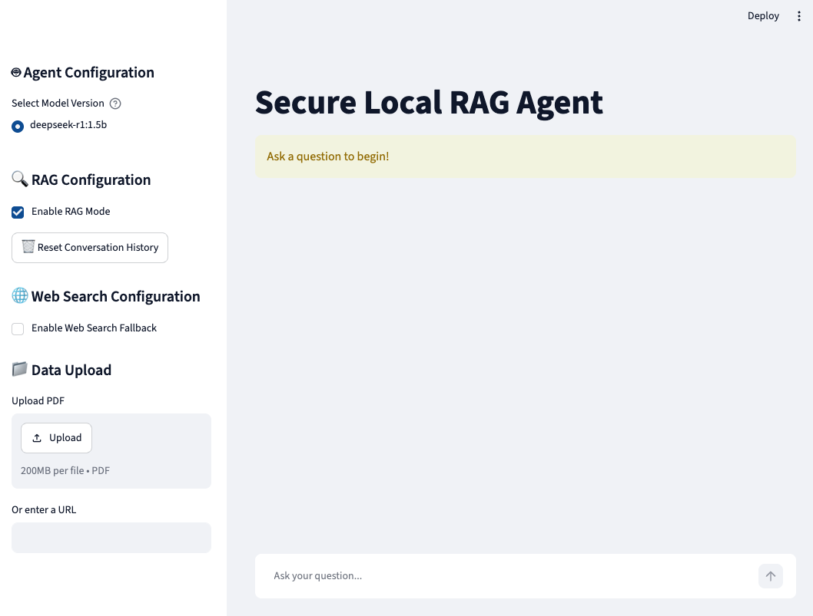

A Streamlit-based RAG agent starter package for local reasoning with DeepSeek.

# 📌 Project Overview
A secure, local Retrieval-Augmented Generation (RAG) agent engineered for deep reasoning over sensitive documentation. Powered entirely on-device via Ollama using DeepSeek-R1, this agent eliminates data exfiltration risks, providing enterprise-grade privacy and advanced analytical capabilities without external LLM API dependencies.

## 🛠️ Tech Stack & Tools Used

- **Model:** DeepSeek-R1 (via Ollama)
- **Framework:** Agno
- **Front:** Streamlit
- **Embeddings:** Google Gen AI
- **Memory:** ChromaBD

## Structure

- `main.py` — Streamlit entrypoint
- `app/` — application package
  - `app/config.py` — environment and runtime configuration
  - `app/ingest.py` — PDF and web ingestion logic
  - `app/retrieval.py` — ChromaDB initialization and retrieval logic
  - `app/agent.py` — RAG and web-search agent builders
  - `app/utils.py` — shared utilities
- `data/chroma_db/` — local vector store path
- `tests/` — example unit tests

## Run

1. Create a `.env` file from `.env.example`
2. Install dependencies:
   ```bash
   # Add all dependencies from `requirements.txt`.
   uv add -r requirements.txt 
   ```
3. Start the app:
   ```bash
   streamlit run main.py
   ```

## Notes

- `GOOGLE_API_KEY` must be provided in environment variables.
- `ollama` should be installed and `deepseek-r1:1.5b` should be available locally.

